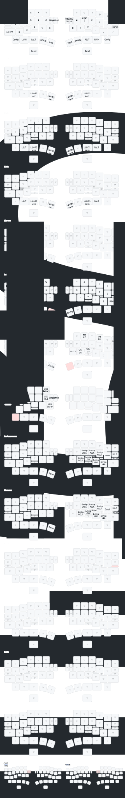
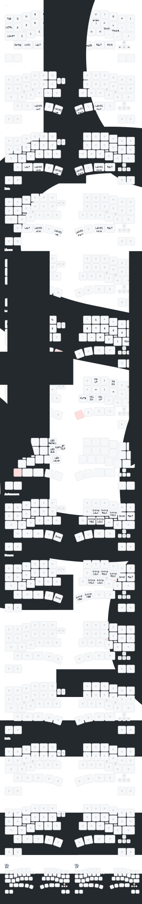

# ZMK board definition for [DYA Dash](https://github.com/cormoran/dya-dash-keyboard) keyboard V2 & V3

DYA Dash のキーボード定義レポジトリです。
`このテンプレートを使用する` (`Use this template`) からレポジトリをクローンすることで、キーマップやパラメータのチューニングができます。
クローンしたレポジトリは [keymap-editor](https://nickcoutsos.github.io/keymap-editor/) での編集にも対応しています。

**注意**: DYA Dash V2, V3 の回路は互換性がありません。書き込むファームウェアを間違えるとキーボードが壊れてしまう可能性があります

This repository contains ZMK board definition for [DYA Dash](https://github.com/cormoran/dya-dash-keyboard) keyboard.
You can configure keymap and tune parameters by forking this repository.
This repository supports [keymap-editor](https://nickcoutsos.github.io/keymap-editor/) to edit keymap from web UI.

**WARN**: DYA Dash V2 and V3 is not compatible. Writing firm for wrong version might damage your hardware.

## Getting started

1. Clone this repository by "Use this template" button in github.
2. Edit files under `config` directory as you like. Please check [ZMK official document](https://zmk.dev/docs/customization)
   - keymap is defined in `dya_dash.keymap` or `dya_dash_v3.keymap`
   - You can define configuration in `dya_dash.conf`, `dya_dash_left.conf` or `dya_dash_right.conf` to tune parameters.
   - You can define configuration in `dya_dash_v3.conf`, `dya_dash_v3_left.conf` or `dya_dash_v3_right.conf` to tune parameters.
3. Build firmware on github actions or in your local PC as described in below.

## Build on github actions

It's configured by default thanks to ZMK's template. Just pushing commit to github starts github actions.
The firmware will be available in "Actions" tab's latest build artifacts as `firmware.zip`.

## Local development in this repository

Install `west` command ([official document](https://docs.zephyrproject.org/latest/develop/west/install.html)). Execute below command.

```
# 1. Initialize west workspace
## Option1: download under ../ if you want to share dependency with other zmk-config
west init -l . --mf config/west.yml
## Option2: download under ./dependencies if you don't want to share dependency
west init -l config --mf west-standalone.yml

# 2. Download dependencies
west update --narrow
west zephyr-export

# 3. Build
west zmk-build -q
## Build with debug
west zmk-build -S zmk-usb-logging
## Build specific firmware # with debug mode and flash
west zmk-build -a right_trackball # -S zmk-usb-logging --flash

## Build v2 firm only
west zmk-build -q -as v2

## Build v3 firm only
west zmk-build -q -as v3
```

If build succeeds, the firmware shows up under `../build/<artifact>/zephyr/zmk.uf2`.

## Trackball enable/disable with snippet

Trackball setting is enabled by specifying snippet `left-trackball` or `right-trackball`. (see `local_build.sh`.).

If neither snippet is specified, trackball feature is disabled.

snippets with `-v3` suffix is for v3. Other snippets are for v2.

## Default keymap for DYA Dash V3

Note that keymap for right side's setting buttons are configured as combo of arrow keys.

Bottom 4 keys are hidden touch sensor pad in circuit.



## Default keymap for DYA Dash V2

Note that keymap for right side's setting buttons are configured as combo of arrow keys.

Bottom 4 keys are hidden touch sensor pad in circuit.


